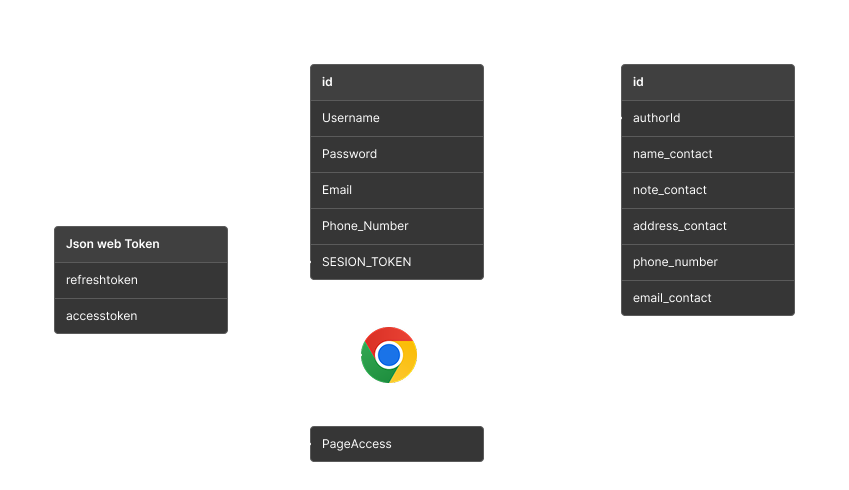

[](https://expressjs.com/)<br>
[](https://www.npmjs.com/package/mongoose)
[](http://badge.fury.io/js/mongoose)
<h1>
Simple API Contact Management
</h1>



<h2>🚀Introduce Learning API </h2>
<P>Goals Learn :  API & Middleware
</P>
<h2>💻Using </h2>
<li>JWT AUTH ( Json Web Token )
<li>Express
<li>Node JS
<li>MongoDb
<h2>🤖Quick Start </h2>

## Initialize Packages

```bash
$ npm install 
```

## Run server.js

```bash
$ node server.js
```

## 🧪API :

### 📭: GET || 📤: POST || 🔰: PUT || ⭕: DELETE

```sh
├──🧪 AUTH
│  └── 📤 /api/auth/register-account
│  └── 📤 /api/auth/login-account
│  └── 📤 /api/auth/logout-account
│  └── 📤 /api/auth/refresh-token
│  ├──🧪 CMS 
│  │  └── 📤 /api/protected/contact-management/add-contact
│  │  └── 📭 /api/protected/contact-management/show-contact
│  │  └── 📭 /api/protected/contact-management/search-contact
│  │  └── 📭 /api/protected/contact-management/get-contact
│  │  └── 🔰 /api/protected/contact-management/update-contact
│  │  └── ⭕ /api/protected/contact-management/delete-contact
```
#### <a href="https://github.com/dariusrisky" target="_blank">Github</a>
